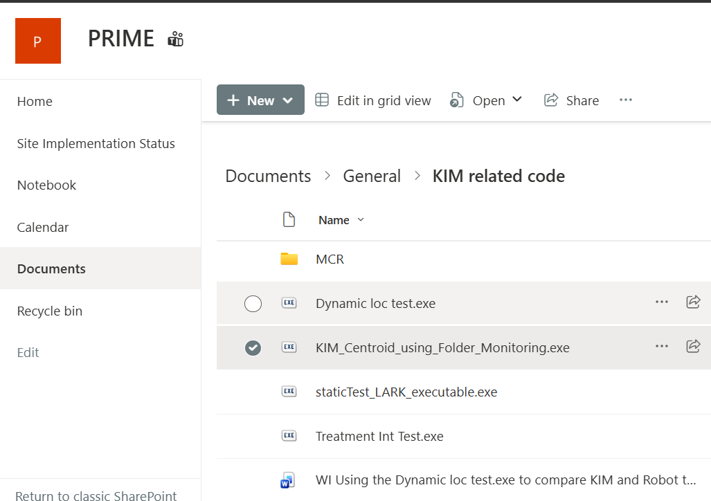
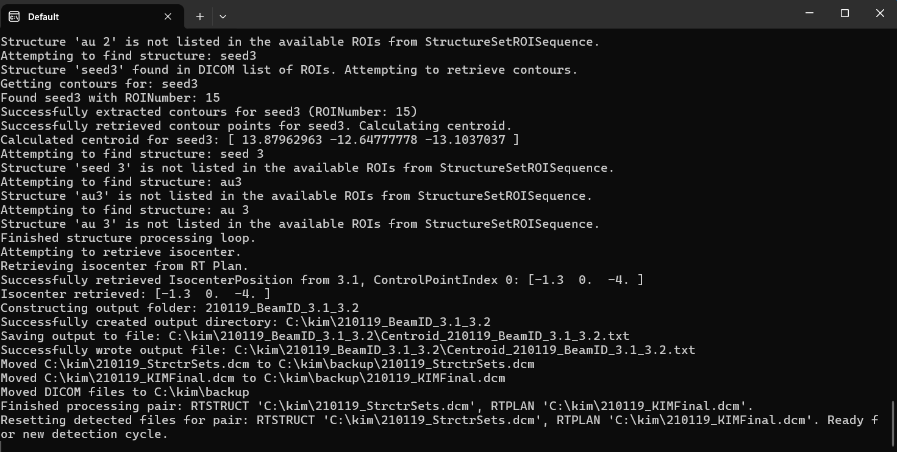

# KIM Centroid Generator - User Guide
**Authors:** KRM, KK

> 📄 **PDF Version Available:** You can also [download this guide as a PDF](USER_GUIDE.pdf) for offline reference and printing.

This guide will help you use the KIM Centroid Generator application to automatically process radiation therapy DICOM files and calculate seed/marker positions. This application runs on your computer and monitors a folder for new DICOM files.

> **⚠️ Clinical Warning:**  
> **DO NOT use this software for clinical purposes unless comprehensive geometric testing has been performed and validated by a qualified medical physicist.**  
> Verification testing must be repeated following any relevant system changes, including but not limited to: treatment machine, treatment planning system (TPS), KIM software, or any other components in the clinical workflow.  
>  
> Failure to perform appropriate testing may result in inaccurate results with catastrophic  clinical risks.


---

## Table of Contents

1. [First-Time Setup](#first-time-setup)
2. [Starting the Application](#starting-the-application)
3. [Daily Usage - Processing Files](#daily-usage---processing-files)
4. [Using Interactive Mode](#using-interactive-mode-advanced)
5. [Stopping the Application](#stopping-the-application)
6. [Understanding Your Results](#understanding-your-results)
7. [Troubleshooting](#troubleshooting)
8. [Getting Help](#getting-help)

---

## First-Time Setup

### Step 1: Create the Monitoring Folder

Before running the application for the first time, you need to create a folder where DICOM files will be placed.

1. Open **File Explorer** (the folder icon on your taskbar)
2. Navigate to **This PC** → **Local Disk (C:)**
3. Right-click in the empty space and select **New** → **Folder**
4. Name the folder exactly: `kim` (lowercase)
5. Your folder path should be: `C:\kim`


**Important:** The folder name must be exactly `kim` in lowercase.

### Step 2: Locate the Application

The application file is named:
```
KIM_Centroid_using_Folder_Monitoring VX.X.exe
```

> **Alert:** Ensure that you have the correct version.  

 The correct version of this file is in the [PRIME SharePoint folder](https://genesiscare.sharepoint.com/:f:/r/sites/PRIME/Shared%20Documents/General/KIM%20related%20code?csf=1&web=1&e=SjfeMO).If uncertain contact the Coordinating Physicist.



*Location of the KIM Centroid Generator executable file in the PRIME SharePoint folder*


### Step 3: Handle Antivirus Warnings (If Needed)

When you first run the application, Windows or your antivirus software may show a warning. This is normal for new applications.

**If Windows Defender shows a warning:**
1. Click **"More info"**
2. Click **"Run anyway"**


**If your antivirus blocks the file:**
- Contact your IT department to add this file to the allowed/trusted list
- The file is safe - it's a medical imaging processing tool necessary for this trial.

---

## Starting the Application

### Step 1: Launch the Application

1. **Double-click** the `KIM_Centroid_using_Folder_Monitoring.exe` file
2. A black window (command prompt) will appear - this is normal!
3. The window shows the application status and activity

### Step 2: Choose Interactive Mode

When the application starts, you'll see this prompt:

```
Enable interactive mode for custom structure selection? (y/n):
```

**What does this mean?**

- **Type `n` and press Enter** - Normal mode (recommended for most users)
  - The application will automatically look for standard structures: seed1, seed2, seed3, au1, au2, au3
  - Best for routine processing

- **Type `y` and press Enter** - Interactive mode
  - If standard structures aren't found, you can manually select which structures to process
  - Best if your files use different naming conventions

**For most users, type `n` and press Enter.**

### Step 3: Verify Monitoring is Active

After selecting your mode, you'll see:

```
Monitoring folder: C:\kim
Press Ctrl+C to stop monitoring
```

The application is now running and watching the `C:\kim` folder for new DICOM files!

> **Alert:**
> **Keep this window open** - the application needs to stay running to monitor for files.


---

## Daily Usage - Processing Files

Once the application is running, follow these simple steps to process DICOM files:

### Step 1: Prepare Your DICOM Files

For each patient, you need **two DICOM files**:
1. **RTSTRUCT file** (Radiation Therapy Structure Set)
2. **RTPLAN file** (Radiation Therapy Plan)

Depending on export process these files typically have names like:
- `RS.1.2.246.352.71.xxxx.dcm` (RTSTRUCT)
- `RP.1.2.246.352.71.xxxx.dcm` (RTPLAN)

### Step 2: Copy Files to the Monitoring Folder

1. Open File Explorer and navigate to `C:\kim`
2. **Copy** (or drag and drop) both DICOM files into this folder

The application will automatically detect them.


### Step 3: Watch the Processing

In the application window, you'll see messages like:

```
New DICOM file detected: RS.1.2.246.352.71.xxxx.dcm
Identified as RTSTRUCT for patient: 12345
New DICOM file detected: RP.1.2.246.352.71.xxxx.dcm
Identified as RTPLAN for patient: 12345
Processing complete pair for patient: 12345
```



*Console window displaying processing messages.*


### Step 4: Find Your Results

After processing (usually takes a few seconds), a new folder is created inside `C:\kim`:

**Folder name format:**
```
PatientID_BeamID_Beam1Name_Beam2Name
```

**Example:**
```
12345_Beam1_BEAM1_BEAM2
```

Inside this folder, you'll find a text file named:
```
centroids.txt
```

This file contains the calculated positions of the seeds/markers.


### Step 5: Processed Files Moved to Backup

After successful processing, the original DICOM files are automatically moved to:
```
C:\kim\backup\
```


## Using Interactive Mode (Advanced)

If you enabled interactive mode and the application cannot find standard structures (seed1-3, au1-3), you'll be prompted to select structures manually.

### When You'll See This

After placing DICOM files, if standard structures aren't found, you'll see:

```
No default structures found. Available structures in RTSTRUCT:
1. PTV
2. CTV
3. GTV
4. Bladder
5. Rectum
6. ProstateSeed_1
7. ProstateSeed_2
8. ProstateSeed_3

Enter structure numbers to process (comma-separated, 'all', or 'skip'):
```

### How to Select Structures

**Option 1: Select specific structures**
- Type the numbers you want, separated by commas
- Example: `6,7,8` (to select ProstateSeed_1, ProstateSeed_2, ProstateSeed_3)
- Press **Enter**

**Option 2: Select all structures**
- Type: `all`
- Press **Enter**
- The application will process every structure in the file

**Option 3: Skip this file**
- Type: `skip`
- Press **Enter**
- The file pair will be moved to backup without processing

[Screenshot: Interactive structure selection prompt]

### Understanding the Results

When you manually select structures, they are labeled as:
- Seed 1 (first structure you selected)
- Seed 2 (second structure you selected)
- Seed 3 (third structure you selected)
- And so on...

The results still appear in the `centroids.txt` file in the patient-specific folder.

---

## Stopping the Application

When you're done for the day or need to stop monitoring:

### Step 1: Stop Monitoring

1. Click on the application window (the black command prompt window)
2. Press **Ctrl+C** on your keyboard (hold Ctrl, then press C)

You'll see a message like:
```
Monitoring stopped by user
```

### Step 2: Close the Window

Simply click the **X** button on the window to close it.

**Note:** You can also just close the window directly - both methods are safe.

---

## Understanding Your Results

### The Centroids File

The `centroids.txt` file contains position information in this format:


```
Patient ID
LastName,FirstName
Seed1, X= x.xx1, Y= y.yy1, Z= z.zz1
Seed2, X= x.xx2, Y= y.yy2, Z= z.zz2
Seed3, X= x.xx3, Y= y.yy3, Z= z.zz3
Isocenter (cm), X= x.xx, Y= y.yy, Z= z.zz
```

For example: 
```
210119
zzKIMe2e,zzKIMe2e
Seed1, X= -1.63, Y= -1.18, Z= 0.69
Seed2, X= -0.09, Y= 1.25, Z= -0.28
Seed3, X= 1.39, Y= -1.26, Z= -1.31
Isocenter (cm), X= -0.13, Y= 0.00, Z= -0.40
```


### What to Do With This File

- KIM software will require this file to be provided before tracking
- Prior to using at your centre ensure that appropriate testing has been conducted to ensure geometric accuracy and compatibility.

---

## Troubleshooting

### Problem: Application Won't Start

**Symptom:** Nothing happens when you double-click the .exe file

**Solutions:**
1. **Check antivirus:** Your antivirus may have blocked or quarantined the file
   - Open your antivirus software
   - Look for quarantined files
   - Restore the file and add it to the allowed list
   - Contact IT if you need help with this

2. **Check file location:** Make sure you're clicking the correct .exe file
   - The file should end in `.exe`
   - File size is approximately 17 MB

### Problem: "Permission Denied" or "Access Denied" Error

**Symptom:** Error messages about file or folder permissions

**Solutions:**
1. **Check folder permissions:**
   - Right-click on `C:\kim` folder
   - Select **Properties** → **Security** tab
   - Ensure your user account has "Full control"
   - Contact IT if you need permissions changed

2. **Run as Administrator (temporary solution):**
   - Right-click the .exe file
   - Select **"Run as administrator"**
   - This should only be needed if there are permission issues

### Problem: Files Not Being Processed

**Symptom:** DICOM files placed in C:\kim but nothing happens

**Solutions:**
1. **Check if application is running:**
   - Look for the black command prompt window
   - If it's closed, restart the application

2. **Verify both files are present:**
   - You need BOTH an RTSTRUCT and RTPLAN file for the same patient
   - Check that Patient IDs match in both files

3. **Check file readiness:**
   - If copying large files over a network, wait 30 seconds after copying
   - The application waits for files to finish transferring

4. **Look for error messages:**
   - Check the black window for red error messages
   - Take a screenshot and send to IT support

### Problem: Can't Find Results

**Symptom:** Processing completed but can't find the output folder

**Solutions:**
1. **Check inside C:\kim:**
   - Open File Explorer
   - Navigate to `C:\kim`
   - Look for folders with patient ID in the name

2. **Check the application window:**
   - Look for messages showing where results were saved
   - The path will be shown after "Created patient output folder:"

### Problem: Application Window Closes Immediately

**Symptom:** Black window appears and disappears instantly

**Solutions:**
1. **Missing monitoring folder:**
   - Make sure `C:\kim` folder exists
   - Create it if it doesn't exist (see First-Time Setup)

2. **File is corrupted:**
   - Try downloading the .exe file again
   - Download fresh copy from PRIME directory and try again. 
   - Try it on a different laptop/workstation.
   - Get someone else to try it.
   - Call trial physicist and ask for another file to regenerated.


---

## Getting Help


### Who to Contact

Contact the KIM WG or authors of this software (KRM, KK) with:
- Software version.
- Description of the problem
- Screenshots of error messages
- The DICOM files you were trying to process.

### Information to Provide

When reporting an issue, include:
- Your name and department
- What you were trying to do
- What happened instead
- Any error messages (with screenshots)
- Patient ID (if relevant and appropriate to share)

---

## Quick Reference Card

**Starting the application:**
1. Double-click `KIM_Centroid_using_Folder_Monitoring.exe`
2. Choose interactive mode (type `n` for normal, `y` for advanced)
3. Keep window open

**Processing files:**
1. Copy RTSTRUCT and RTPLAN files to `C:\kim`
2. Wait for processing (watch the application window)
3. Find results in new patient folder inside `C:\kim`

**Stopping the application:**
1. Press Ctrl+C in the application window, or
2. Close the window

**Finding results:**
- Location: `C:\kim\PatientID_BeamID_Beam1_Beam2\`
- File name: `centroids.txt`

**Getting help:**
- Contact KIM Working Group, Authors

---

*This guide was created for clinical users of the KIM Centroid Generator application. For technical documentation, developers should refer to README.md. in the repository*

**Version:** 1.0
**Last Updated:** November 2025
